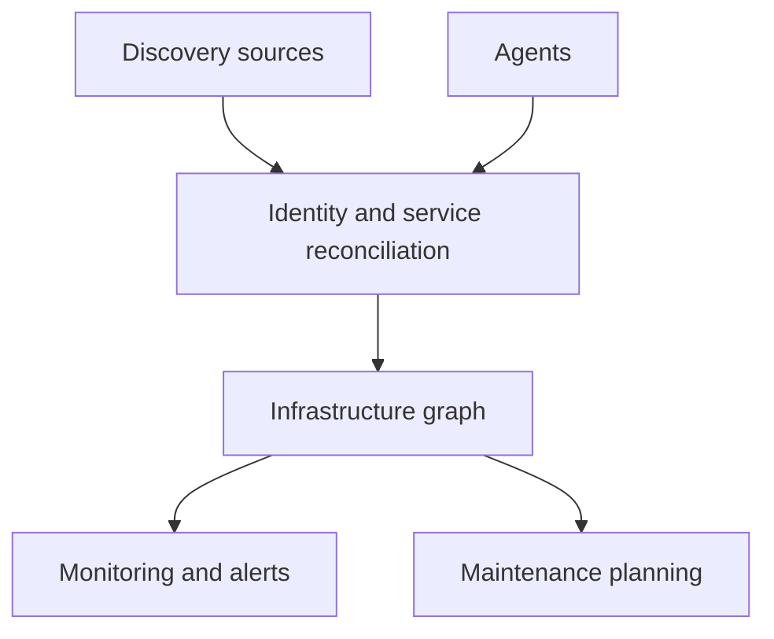
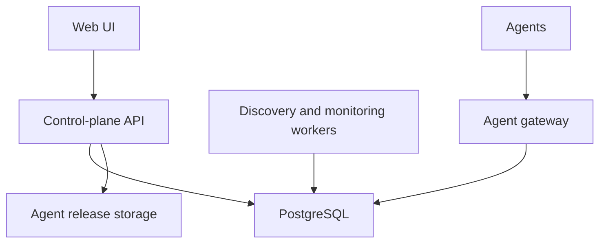

# Homelab Operations Platform

**Product and engineering specification**  
**Status:** Initial implementation plan  
**Project name:** To be decided  
**Initial audience:** A single trusted homelab operator  
**Licence:** Open source; exact licence to be chosen before the first public release

---

## 1. Executive summary

This project is a self-hosted infrastructure discovery, inventory, monitoring, dependency, and maintenance-planning platform for a mixed homelab.

Its defining feature is not simply uptime monitoring. It maintains a **living model of the infrastructure**: devices, interfaces, virtual machines, containers, services, checks, dependencies, credentials, agents, and maintenance events all refer to the same underlying entities.

The first release will:

- discover devices on explicitly configured networks;
- scan every TCP port on discovered devices, with safe rate controls;
- fingerprint services regardless of which port they use;
- reconcile evidence from network scans, agents, Docker, mDNS, SNMP, APIs, and manual configuration;
- create appropriate uptime checks for discovered services;
- install an agent over SSH using credentials supplied in the UI;
- collect system and workload inventory from agents;
- update agents from the central server, including on hosts without internet access;
- model dependencies and suppress redundant downstream alerts;
- schedule maintenance reservations and detect conflicts before they occur;
- report changes such as new ports, removed services, new containers, upgrades, and reboots.

The initial product **will not execute general operating-system, application, appliance, or firmware updates**. It will only plan maintenance and reserve affected resources. Update orchestration can be added later, once the inventory and dependency model are trustworthy.

---

## 2. Product vision

The platform should answer four questions from one interface:

1. **What exists on my network?**
2. **What is each thing running, and is it healthy?**
3. **What depends on what?**
4. **Will planned maintenance conflict with anything else?**

It should turn this:

> `192.168.1.50:49173` is open.

into this:

> The `weird-custom-app` Docker container on `docker01` publishes HTTP on `192.168.1.50:49173`. The port is externally reachable, the container is healthy, its HTTP check passes, and it depends on the Docker host, switch, DNS, and network core.

The product should feel useful after its first scan but become increasingly accurate as the operator confirms identities, installs agents, and adds dependencies.

### 2.1 Product principles

1. **One infrastructure model**  
   Discovery, inventory, monitoring, dependencies, alerts, and maintenance must use the same entities.

2. **Evidence, not duplication**  
   Multiple discovery sources should strengthen one record rather than create competing copies.

3. **Safe by default**  
   Scanning is restricted to approved scopes, secrets are protected, agent releases are signed, and potentially disruptive automation is deferred.

4. **External and internal truth**  
   An agent can report that a service is listening; the server independently verifies that it is reachable.

5. **Explain every conclusion**  
   The UI must show why a device was matched, why a service was identified, why an alert was suppressed, and why maintenance conflicts.

6. **Personal-first, not enterprise-first**  
   The initial deployment should be manageable by one person and run as a small Docker Compose stack. Multi-tenancy and enterprise workflow are out of scope.

7. **Useful partial knowledge**  
   Unknown devices and unidentified services are valid records. The system must not require perfect classification before monitoring them.

---

## 3. Scope

### 3.1 In scope for v1

- IPv4 subnet discovery on explicitly approved CIDRs.
- Full TCP port scans over ports `1–65535`.
- Targeted UDP discovery by default and optional full UDP scans.
- Service fingerprinting using safe protocol probes.
- Stable device identity independent of IP address.
- Device merge, split, and identity correction.
- HTTP, HTTPS, TCP, TLS certificate, DNS, ICMP/ping, API-content, and agent-heartbeat monitoring.
- Automatic monitor proposals and configurable automatic creation.
- Linux agent installation over SSH.
- Linux `amd64` and `arm64` agents.
- Agent inventory for the host, sockets, systemd, packages, Docker, containers, and virtualisation metadata where accessible.
- Agent self-update from the server.
- Server-triggered agent update.
- SSH-based agent installation and repair.
- Dependency and containment graph.
- Root-cause-aware alert grouping and downstream suppression.
- Maintenance calendar, resource reservations, conflict detection, overruns, and monitoring suppression.
- Change history and audit log.
- Webhook notifications plus at least one directly supported notification provider.
- Single-user authentication initially, while retaining an authorization boundary in the code.
- Docker Compose deployment and documented backup/restore.

### 3.2 Explicitly out of scope for v1

- Executing general OS, package, container-image, application, appliance, or firmware updates.
- Configuration management comparable to Ansible, Salt, or Puppet.
- Arbitrary remote shell access from the UI.
- Internet-wide or unapproved network scanning.
- Vulnerability exploitation or credential brute forcing.
- Packet capture or deep traffic inspection.
- Full log management/SIEM functionality.
- Long-term, high-cardinality metrics storage comparable to Prometheus.
- Multi-tenant hosted service.
- Mobile-native applications.
- Windows and macOS agents unless added after the Linux agent is stable.
- High-availability control-plane clustering.

### 3.3 Likely post-v1 extensions

- Maintenance execution workflows.
- Package and container update orchestration.
- UniFi, Proxmox, Home Assistant, NAS, and UPS integrations.
- Additional agents and remote collectors.
- SNMP polling and trap ingestion.
- Prometheus/OpenTelemetry ingestion or export.
- Configurable plugin SDK.
- Resource-specific runtime locks for maintenance execution.
- Multiple users and roles.

---

## 4. Core domain model

The dependency graph is the centre of the system. Discovery sources populate it, monitoring attaches checks to it, alerts traverse it, and maintenance reserves parts of it.



### 4.1 Principal entities

| Entity | Purpose | Important fields |
|---|---|---|
| Site | Optional physical/logical location | name, timezone |
| Network | Approved discovery boundary | CIDR, VLAN, gateway, scan policy |
| Device | Stable physical or virtual machine/appliance identity | UUID, type, name, status, identity confidence |
| Interface | Network attachment belonging to a device | MAC, IPs, VLAN, first/last seen |
| Workload | VM, LXC, Docker container, or other hosted unit | type, runtime ID, image/template, host device |
| Service | A reachable or locally listening capability | protocol, endpoint, product fingerprint, owner entity |
| Evidence | An observation supporting an entity or relationship | source, value, confidence, timestamps |
| Monitor | A configured health check | type, target, interval, thresholds, ownership |
| Observation | A raw or normalized check/inventory result | timestamp, state/value, source |
| Incident | A durable unhealthy episode | state, severity, root cause, affected entities |
| Dependency | A directional operational requirement | consumer, provider, kind, criticality |
| Containment | Structural parent/child relation | host/container, device/interface, service/workload |
| Credential | Protected management credential | type, scope, encrypted payload, usage audit |
| Agent | Enrolled software identity | certificate, device, version, capabilities, last seen |
| Agent release | Signed distributable binary | version, platform, architecture, hash, signature |
| Maintenance event | Planned reservation | schedule, targets, required resources, affected resources |
| Change event | Material difference in observed state | entity, before/after, source, severity |
| Notification rule | Routing and suppression policy | match conditions, delay, provider, escalation |
| Audit event | Security and administration history | actor, action, target, result, timestamp |

### 4.2 Identity rules

A device must never be identified solely by IP address. Every device receives an internal immutable UUID.

Identity evidence may include:

- enrolled agent ID;
- hardware or virtual-machine UUID;
- MAC address;
- machine ID;
- serial number;
- Proxmox VM/LXC ID plus host identity;
- Docker container ID plus engine identity;
- stable hostname;
- SSH host key;
- SNMP engine ID;
- TLS certificate identity;
- known interface/IP history.

The reconciliation engine assigns a confidence score and records the reasons for a match. It must support:

- automatic high-confidence matches;
- suggested matches requiring confirmation;
- manual merge;
- manual split;
- pinning a known identity rule;
- undoing a merge without losing observation history.

### 4.3 Services and endpoints

A service is conceptually distinct from an endpoint.

For example, one Sonarr service may have:

- a listening socket inside a container;
- a Docker-published host port;
- a reverse-proxy URL;
- an internal DNS name;
- one or more external checks.

The model should therefore represent:

```text
Service: Sonarr
  owned by: workload/sonarr
  endpoints:
    - http://192.168.1.20:8989
    - https://sonarr.lab.example
  evidence:
    - network scan
    - agent socket inventory
    - Docker metadata
    - HTTP fingerprint
```

### 4.4 Evidence model

Every inferred fact must retain:

- source type;
- source instance;
- first seen;
- last seen;
- confidence;
- raw reference or normalized attributes;
- expiry policy;
- whether a user confirmed or overrode it.

Manual confirmation outranks inference. A stale discovery result should not immediately delete an entity; it marks the evidence absent and allows configured expiry or manual review.

---

## 5. System architecture

### 5.1 Deployment shape

Start as a modular monolith with background workers, not microservices.



Recommended deployable components:

1. **Server** – API, authentication, UI backend, reconciliation, graph logic, scheduler, alerting, release distribution.
2. **Worker** – network scanning, fingerprinting, and monitor execution; initially the same image as the server with a different process role.
3. **PostgreSQL** – authoritative configuration, inventory, evidence, state, and bounded observation history.
4. **Web UI** – bundled with the server or served as a static frontend.
5. **Agent** – one small binary per monitored host.

Avoid mandatory Redis, Kafka, Elasticsearch, or Kubernetes in v1. Use a PostgreSQL-backed job queue with leases, retries, and idempotency keys. This keeps installation and recovery simple while allowing workers to be split later.

### 5.2 Recommended implementation stack

This is a recommendation rather than a product requirement:

- **Agent:** Rust, distributed as a single signed binary.
- **Server:** Rust with Axum, sharing protocol/domain crates with the agent where useful.
- **Frontend:** React/TypeScript.
- **Database:** PostgreSQL.
- **API:** versioned JSON HTTP API for the UI; WebSocket or Server-Sent Events for live status.
- **Agent transport:** outbound TLS connection using short-lived session authentication backed by an enrolled client identity.
- **Packaging:** Docker Compose for the server; `.deb`, `.rpm` later, and raw binaries for agents.

The repository should be a monorepo so schemas, generated clients, migrations, protocol fixtures, and release tooling change atomically.

Suggested top-level layout:

```text
apps/
  server/
  web/
  agent/
crates/
  domain/
  protocol/
  discovery/
  monitoring/
  reconciliation/
  maintenance/
  secrets/
deploy/
  compose/
docs/
```

### 5.3 Scalability target

Optimise v1 for a homelab with approximately:

- 1–10 IPv4 subnets;
- up to 1,000 discovered devices;
- up to 10,000 services/checks;
- up to 500 agents;
- second-to-minute monitoring intervals;
- at least 90 days of incident and change history.

This is a sizing boundary, not a hard-coded limit.

---

## 6. Discovery subsystem

### 6.1 Discovery scopes

Scanning must only occur inside an explicitly approved scope. Each network has:

- CIDR;
- optional excluded addresses/ranges;
- scan source/worker;
- discovery cadence;
- full TCP cadence;
- TCP concurrency and per-host rate limit;
- UDP mode;
- fingerprint depth;
- maintenance/quiet periods.

The server must reject accidentally broad public ranges by default and clearly display the exact target count before the first scan.

### 6.2 Discovery pipeline

1. Discover live or recently known addresses using ARP/NDP where local, ICMP, and selected TCP probes.
2. Match the address/interface to an existing device or create an unconfirmed device.
3. Run a full TCP scan across `1–65535` for a new device.
4. Fingerprint each open port.
5. Reconcile endpoints and services with agent, Docker, API, mDNS, UPnP, SNMP, and prior evidence.
6. Propose or automatically create monitors according to policy.
7. Emit change events for meaningful differences.

### 6.3 TCP scanning policy

Full TCP scanning is necessary because Docker and custom services may publish on any port.

Use three separate activities:

| Activity | Purpose | Typical cadence |
|---|---|---|
| Initial discovery scan | Establish all reachable TCP ports | When a device is first found |
| Change scan | Find newly opened/closed ports | Every 6–24 hours, configurable |
| Monitoring | Check already known services | Every 30–60 seconds, configurable |

Requirements:

- scan all ports `1–65535` by default for approved devices;
- configurable connect or SYN scanning depending on privileges;
- bounded global, subnet, and per-host concurrency;
- jitter and backoff;
- pause scanning during relevant maintenance;
- never perform login attempts or exploit probes;
- let operators exclude fragile devices or use a low-impact policy;
- retain scan duration, source, and completeness so partial scans are not treated as authoritative closure evidence.

### 6.4 UDP policy

UDP is not treated like TCP because silence is ambiguous and a full scan can be slow and noisy.

- Target common/configured UDP protocols by default.
- Accept agent-reported UDP listeners as strong internal evidence.
- Allow an operator to request full UDP scanning for a network or device.
- Record results as `open`, `closed`, or `open|filtered/unknown` rather than forcing a binary state.

### 6.5 Service fingerprinting

Fingerprint inputs may include:

- TCP banners;
- HTTP status, headers, title, small bounded body sample, and redirects;
- TLS handshake, ALPN, certificate subject/SAN, issuer, and expiry;
- SSH banner and host key;
- safe protocol-specific probes;
- mDNS/DNS-SD;
- UPnP/SSDP;
- SNMP where configured;
- agent-reported process/socket ownership;
- Docker image, labels, port mappings, and health state;
- known product signatures.

Fingerprints should produce a product guess, protocol, version when safely available, confidence, and supporting evidence. Unknown services remain monitorable as generic TCP/TLS/HTTP endpoints.

### 6.6 Reconciliation

Reconciliation consumes discoveries from multiple sources and produces one canonical graph.

It must:

- deduplicate repeated observations;
- associate published ports with Docker containers;
- associate reverse-proxy URLs with their upstream service when known;
- distinguish a physical host from its VMs, LXCs, and containers;
- preserve conflicting evidence for review;
- never silently replace a user-confirmed identity;
- expose a review queue for low-confidence matches;
- make every automatic merge explainable.

---

## 7. Agent subsystem

### 7.1 Agent goals

The agent provides internal information that network scanning cannot reliably obtain, while the server continues to verify external reachability.

The agent must:

- initiate its own outbound connection to the server;
- use a unique enrolled identity;
- operate on LAN-only hosts with no internet access;
- buffer bounded observations while disconnected;
- advertise capabilities rather than assuming every host supports every collector;
- be remotely updateable from the server;
- recover safely from a failed upgrade.

### 7.2 Initial Linux inventory

The agent should report:

- agent version and capabilities;
- OS, distribution, kernel, architecture, boot ID, uptime, and machine ID hash;
- CPU model/count/load and memory use;
- filesystems, mounts, capacity, and inode use;
- block devices and SMART summary when permission allows;
- network interfaces, addresses, routes, and link state;
- listening TCP and UDP sockets with owning process where accessible;
- selected processes and systemd unit state;
- installed packages, pending package updates, and reboot-required state;
- temperatures and hardware sensors where available;
- Docker engine identity and version;
- containers, images, labels, health, networks, mounts, and published ports;
- virtualisation/container context;
- Proxmox host/guest metadata when detected and permitted.

Collection intervals should differ by data volatility. Static inventory should not be resent every few seconds.

### 7.3 Bootstrap and enrollment

UI flow:

1. Select a discovered Linux device.
2. Click **Install agent**.
3. Choose or create an SSH credential.
4. Server verifies the SSH host key and shows any first-use trust decision.
5. Server detects OS and architecture.
6. Server creates a short-lived, one-time enrollment token.
7. Server uploads or instructs the host to download the correct agent from the server.
8. Installer creates the service and configuration with restrictive permissions.
9. Agent exchanges the token for its durable identity/certificate.
10. Agent connects and the UI verifies reported identity against the selected device.

The one-time token must expire quickly and be single-use. The agent never receives the SSH credential. The credential may be disassociated after enrollment unless retained for repair or other explicitly enabled management.

### 7.4 Agent privilege model

For v1, a root-owned system service may be necessary for socket ownership, SMART, package, and system inventory. Minimise risk by:

- using a fixed set of compiled collectors;
- not exposing arbitrary command execution;
- applying timeouts and output limits;
- dropping privileges for collectors where possible;
- using read-only APIs/sockets where possible;
- documenting Docker socket access as root-equivalent;
- signing commands and validating their schema;
- auditing privileged operations.

Longer term, split collection into an unprivileged agent plus a narrowly scoped privileged helper if that materially reduces risk.

### 7.5 Agent release repository

The server owns a local repository/cache of supported agent binaries. Agents download from the server, not directly from GitHub or another internet service.

Each release contains:

- semantic version;
- platform and architecture;
- minimum compatible server/protocol version;
- binary size;
- SHA-256 digest;
- Ed25519 signature;
- release notes;
- rollout status.

Initial platforms:

- Linux `amd64`;
- Linux `arm64`.

### 7.6 Update modes

Support three paths:

1. **Automatic self-update** – agent checks the server's approved release channel and updates according to policy.
2. **Server-triggered update** – operator clicks **Update agent**; the connected agent downloads the selected signed release from the server.
3. **SSH repair** – server uses a saved SSH credential to reinstall or replace an agent that cannot update or connect.

Policies per agent/group:

- automatic;
- notify only;
- manual;
- pinned version/channel.

The architecture should allow staged deployment such as canary, 25%, then all agents, even if the first UI only supports manual and automatic.

### 7.7 Atomic upgrade and rollback

An agent upgrade must:

1. Download to a new path.
2. Verify platform, hash, and signature.
3. Run a version/self-test command.
4. Keep the current binary as a rollback copy.
5. Atomically activate the new binary.
6. Restart under the service manager.
7. Confirm successful check-in within a deadline.
8. Roll back automatically if startup or check-in fails.

The trusted signing public key is embedded in the agent. Key rotation must be designed before public releases, using releases signed by both the old and new key during a transition.

---

## 8. Monitoring subsystem

### 8.1 Check types for v1

- ICMP/ping where permitted;
- TCP connect;
- HTTP/HTTPS status;
- HTTP body/header/content assertion;
- API response assertion;
- TLS handshake and certificate expiry;
- DNS resolution and expected answer;
- agent heartbeat;
- agent metric threshold;
- Docker/container running and health state.

### 8.2 Automatic monitor creation

Discovery does not directly hard-code monitors. It emits a service classification, and policy decides what to do.

Example policies:

```text
If service.protocol == https:
  propose HTTPS reachability + TLS expiry

If fingerprint.product == Plex:
  propose GET /identity with content assertion

If confidence >= 0.90 and policy == automatic:
  create and enable checks
else:
  add proposals to review queue
```

Each generated monitor records its generating rule. User edits convert it into a user-managed override or a rule-compatible customization, so later discovery does not erase changes.

### 8.3 Check lifecycle

Checks need:

- configurable interval and timeout;
- failure and recovery thresholds;
- jitter;
- retry policy;
- assigned execution worker/location;
- last success/failure and latency;
- paused/suppressed/maintenance states;
- bounded result retention;
- a distinction between `unknown`, `healthy`, `degraded`, and `down`.

Default anti-flapping behaviour:

```yaml
interval: 30s
failure_threshold: 3
recovery_threshold: 2
```

### 8.4 Incidents and root cause

A failed check opens or contributes to an incident rather than emitting a standalone notification every time.

The dependency engine should determine:

- most likely upstream/root-cause entity;
- directly failed entities;
- indirectly affected entities;
- suppressed downstream notifications;
- confidence and reasoning.

Example:

> **Switch unreachable**  
> Direct failure: switch management and ping checks  
> Affected: `crypt`, Plex, Sonarr, Radarr  
> Four downstream alerts suppressed

Do not suppress evidence or incidents themselves; suppress redundant notifications while retaining the full diagnostic view.

### 8.5 Notifications

The first release should support:

- generic outbound webhook;
- at least one of ntfy, Gotify, Discord, email, or Pushover;
- recovery notifications;
- maintenance start/end/overrun notifications;
- notification delays and severities;
- test-notification function;
- provider health/errors;
- quiet hours where appropriate.

Routing rules should be able to express:

```text
Critical → immediately
Warning → after 5 minutes
Info → UI only
During maintenance → suppress expected failures
Upstream failure → suppress child notifications
```

---

## 9. Dependency graph

### 9.1 Relationship types

Keep structural containment separate from operational dependency.

**Containment examples:**

- interface belongs to device;
- VM is hosted by Proxmox node;
- container runs on Docker host;
- service belongs to workload.

**Dependency examples:**

- service requires DNS;
- host requires a switch;
- application requires a database;
- VM requires host and storage;
- internet-facing check requires gateway and WAN.

Dependency edges include:

- provider and consumer;
- dependency kind;
- hard or soft criticality;
- manually confirmed or inferred origin;
- evidence/confidence;
- optional health propagation rule.

### 9.2 Graph safeguards

- Detect and reject or explicitly handle cycles.
- Show the inferred blast radius before saving a dependency change.
- Retain provenance for inferred edges.
- Allow manual edges to override inference.
- Never delete a manual edge because a discovery source disappears.
- Provide a compact topology view and a table view; neither should be the only editing method.

### 9.3 Inference examples

- Docker container → Docker engine → host device.
- VM/LXC → Proxmox node → storage/network.
- IP interface → observed switch port when SNMP/controller information exists.
- DNS-name endpoint → configured DNS resolver.
- reverse-proxy endpoint → proxy service → upstream application.

Inferred dependencies should begin as visible suggestions unless their inference rule is deterministic and enabled by the operator.

---

## 10. Maintenance planning

### 10.1 Purpose

v1 maintenance is a planning and coordination system. It does not execute updates.

It must prevent situations such as a Proxmox maintenance event starting while the UDM Pro may be rebooting, even when the two events were created independently.

### 10.2 Event model

A maintenance event contains:

- name and description;
- timezone-aware start/end or duration;
- one-time or recurring schedule;
- target entities;
- required resources/entities;
- affected resources/entities;
- lead-in reservation time;
- cooldown/stability time;
- expected health changes;
- notification and suppression policy;
- owner/source;
- notes and links.

States:

- draft;
- scheduled;
- upcoming;
- active;
- overrunning;
- completed;
- cancelled.

### 10.3 Conflict rules

Two overlapping events conflict when any of the following is true:

- event A affects a resource required by event B;
- event B affects a resource required by event A;
- both exclusively reserve the same resource;
- one event targets an entity contained by or dependent on an entity affected by the other;
- a configurable global disruptive-maintenance lock applies.

The initial safe default is:

> Only one disruptive infrastructure maintenance event at a time.

Operators can later use resource-specific reservations such as:

```text
network-core
internet
storage
proxmox-cluster
node:crypt
node:catacomb
nas
```

### 10.4 Forward-looking validation

Recurring schedules must be expanded over a configurable horizon, initially 90 days, to find future collisions.

Conflict output should explain the relationship:

> `UDM Pro firmware` affects `network-core` from 00:00–00:20.  
> `crypt maintenance` requires `network-core` from 00:15–00:30.  
> These events overlap by five minutes.

The system should offer safe resolutions such as moving the second event after the first event plus cooldown. It must not silently reschedule events.

### 10.5 Active and overrunning maintenance

When an event is active:

- expected monitor failures are suppressed from notifications;
- the underlying observations and incidents remain visible;
- affected/downstream entities show a maintenance state;
- unrelated failures still alert.

If the planned end passes while expected entities remain unhealthy, mark the event overrunning, retain the reservation, and notify according to policy. Completion can initially be manual or based on simple configured health conditions; automated maintenance execution remains out of scope.

---

## 11. Change detection and history

The platform should record meaningful state transitions, not every repeated sample.

Examples:

- device first seen or absent beyond threshold;
- interface address changed;
- port opened or closed;
- service fingerprint changed;
- TLS certificate changed or approaches expiry;
- Docker container added, removed, restarted, or changed image;
- installed agent version changed;
- OS/kernel/firmware version changed;
- host rebooted;
- pending updates count materially changed;
- dependency or monitor changed;
- maintenance created, edited, started, overran, or completed.

Every change event should include before/after values, evidence source, time, entity, and importance. Noisy values such as CPU percentage belong in observations, not the change feed.

The UI needs:

- global chronological change feed;
- per-device/service history;
- filters by category and severity;
- acknowledgement or hide rules for noisy change types.

---

## 12. Credentials and security

### 12.1 Credential types

Initial types:

- SSH private key and optional passphrase;
- SSH username/password;
- HTTP/API username/password;
- bearer/API token;
- optional client certificate.

Credentials may be scoped to:

- one device;
- a manually defined device group;
- an integration;
- a network, only when explicitly allowed.

The system should try only credentials the operator explicitly selects or scopes. Discovery must never become credential spraying.

### 12.2 Secret protection

- Encrypt secret payloads at rest with authenticated encryption.
- Keep the master encryption key outside the database.
- Never return an existing secret value through the normal API.
- Redact secrets and derived authorization headers from logs and errors.
- Audit creation, update, deletion, and use.
- Support credential rotation.
- Verify SSH host keys and present first-use/change warnings.
- Prevent frontend access to decrypted secrets.
- Use short-lived in-memory decryption only in the worker performing the operation.

For a personal single-node deployment, a key supplied through a mounted secret or environment/file secret is acceptable. Document that backing up only the database without the encryption key makes credentials unrecoverable.

### 12.3 Authentication and authorization

v1 may be single-user, but internal APIs must still distinguish:

- unauthenticated agent enrollment;
- authenticated agent;
- authenticated operator;
- internal worker.

Use secure session cookies, CSRF protection, rate limiting, and an initial admin setup flow. OIDC can follow later.

### 12.4 Agent trust

- All agent-server traffic uses TLS.
- Enrollment tokens are short-lived and one-time.
- Each enrolled agent has an independently revocable identity.
- Server commands are typed, bounded, and authenticated.
- General arbitrary shell execution is prohibited in v1.
- Agent binaries are signed and verified independently of transport security.
- Agent removal/revocation does not delete historical inventory.

### 12.5 Audit log

Audit at least:

- sign-in and failed authentication;
- credential use and changes;
- scan-scope changes;
- agent enrollment, revocation, update, rollback, and repair;
- identity merges/splits;
- monitor and dependency changes;
- maintenance lifecycle changes;
- notification configuration changes.

---

## 13. User experience

### 13.1 Primary navigation

- **Overview** – current incidents, maintenance, coverage, changes, and agent status.
- **Infrastructure** – devices, workloads, services, networks, topology.
- **Monitoring** – checks, incidents, certificates, proposals.
- **Maintenance** – calendar, reservations, conflicts, overruns.
- **Changes** – global change feed.
- **Agents** – versions, rollout/update state, capabilities, failures.
- **Settings** – discovery, credentials, notifications, policies, retention.

### 13.2 First-run flow

1. Create admin account.
2. Configure server URL and agent trust information.
3. Add a network CIDR.
4. Review exact scan target count and rate limits.
5. Run discovery.
6. Review discovered devices and service proposals.
7. Install an agent on one supported Linux host.
8. Confirm auto-monitor policy.
9. Configure a notification provider.
10. Create the first maintenance event.

### 13.3 Device page

A device page should show:

- identity and confidence;
- interfaces/IP history;
- current health and active incident;
- discovered services and monitors;
- hosted workloads;
- agent status/inventory;
- upstream dependencies and downstream blast radius;
- recent changes;
- planned maintenance;
- credential associations without secret values;
- actions such as install/update/repair agent, rescan, merge, and edit dependencies.

### 13.4 Explainability

Every inferred or automatic result needs a **Why?** view. Examples:

- “Matched to existing device because agent ID and machine ID agree.”
- “Identified as Sonarr from Docker image, page title, and API signature.”
- “Plex alert suppressed because its host is unreachable.”
- “Maintenance conflicts because `crypt` requires `network-core`.”

---

## 14. API and event contracts

### 14.1 API guidelines

- Prefix public APIs with `/api/v1`.
- Use stable UUIDs, never IP addresses, as resource identifiers.
- Require idempotency keys for mutating background actions such as scans and agent repair.
- Return job IDs for long-running work.
- Use cursor pagination for histories and inventories.
- Include optimistic concurrency/version fields on user-edited graph and maintenance records.
- Provide a documented webhook event format.

Representative resources:

```text
/api/v1/networks
/api/v1/devices
/api/v1/workloads
/api/v1/services
/api/v1/monitors
/api/v1/incidents
/api/v1/dependencies
/api/v1/maintenance-events
/api/v1/agents
/api/v1/agent-releases
/api/v1/changes
/api/v1/credentials
/api/v1/jobs
```

### 14.2 Agent protocol

The protocol must be versioned separately from the agent binary. Messages include:

- hello/capabilities;
- heartbeat;
- inventory snapshot and incremental changes;
- observations;
- command request/acknowledgement/result;
- update instruction and progress;
- server compatibility response.

Large inventory should be chunked/compressed and bounded. Every message requires a unique ID so retries are idempotent. The server should tolerate agents a defined number of protocol versions behind and clearly report incompatibility.

---

## 15. Reliability and operational requirements

### 15.1 Failure behaviour

- A server restart must not lose scheduled work, incident state, or maintenance reservations.
- Jobs use leases so abandoned work can be retried.
- Monitor executions are idempotent and late results are identified.
- A disconnected agent buffers a bounded amount of important inventory/change data.
- Discovery failure must not mark every unscanned port closed.
- Notification failures retry with backoff and remain visible.
- Database unavailability must fail closed for credential use and agent commands.

### 15.2 Backups

Document and test:

- PostgreSQL backup;
- encryption/signing key backup;
- agent release repository backup or reproducible repopulation;
- full restore into a clean deployment;
- consequences of missing secrets.

The application should expose backup-readiness warnings if required external key material is not configured.

### 15.3 Retention defaults

Suggested initial defaults:

- raw high-frequency monitor samples: 30 days;
- hourly rollups: 1 year;
- incidents: indefinite until operator policy changes;
- changes: 1 year;
- inventory evidence: retain current plus meaningful history;
- audit events: 1 year;
- job logs: 30 days with secret redaction.

All values must be configurable. Implement deletion in bounded batches.

### 15.4 Observability of the observer

Expose:

- `/health/live` and `/health/ready`;
- scan queue depth and age;
- monitor execution delay;
- agent connection count and staleness;
- notification errors;
- database migration/version status;
- internal structured logs;
- Prometheus-compatible metrics as a post-MVP or stretch v1 item.

The UI should clearly warn when monitoring is delayed, so “everything green” is not confused with “checks are not running.”

---

## 16. Testing strategy

### 16.1 Required test layers

- Unit tests for reconciliation, graph traversal, conflict detection, state machines, and cryptographic verification.
- Property tests for identity merging, graph cycles, recurrence expansion, and scan result reconciliation.
- Integration tests with PostgreSQL and background jobs.
- Protocol compatibility tests using recorded agent/server fixtures.
- Container-based service fingerprint fixtures.
- End-to-end tests covering discovery through incident and maintenance suppression.
- Upgrade/rollback tests for agents.
- Security tests for credential redaction, authorization boundaries, enrollment replay, and malicious payload limits.

### 16.2 Test lab fixtures

Maintain a repeatable Docker/VM test lab containing:

- HTTP and HTTPS services on non-standard ports;
- multiple Docker-published applications;
- a port that opens/closes during a test;
- TLS certificates near expiry;
- a failing upstream dependency with healthy/unhealthy children;
- an old agent and a deliberately broken update;
- a host with no internet access but access to the server;
- overlapping recurring maintenance events;
- ambiguous device identity cases.

### 16.3 Definition of done

A feature is not complete until it has:

- migration/schema changes where required;
- API and UI behaviour;
- permission and audit treatment;
- failure/timeout behaviour;
- unit/integration coverage;
- user documentation;
- an upgrade path from the previous released schema/protocol.

---

## 17. Milestoned implementation plan

The sequence below reduces architectural risk early. Each milestone ends in a demonstrable, releasable state and has a strict gate before the next milestone begins.

### Milestone 0 — Repository and engineering foundation

**Goal:** Establish a repeatable development and release base before domain features accumulate.

**Deliverables**

- Monorepo and module boundaries.
- Server, worker, web, and agent skeletons.
- PostgreSQL migrations and local Docker Compose environment.
- Configuration loading and secret-source conventions.
- Structured logging, request IDs, health endpoints, and job framework.
- Authentication bootstrap for a single admin.
- CI for formatting, linting, tests, migrations, container builds, and agent cross-compilation.
- Signed-development-release pipeline and generated checksums.
- Architecture decision records for database, queue, agent transport, and signing.
- Threat model covering scanning, stored credentials, enrollment, agent privilege, and update supply chain.

**Acceptance gate**

- A clean machine can start the stack from documentation.
- Migrations apply to an empty database and upgrade from the previous test schema.
- Server and agent complete a minimal authenticated development handshake.
- CI builds Linux `amd64` and `arm64` agent binaries.
- No production/default secret is embedded in images or source.

**Not included**

- Real scanning, monitors, or inventory.

---

### Milestone 1 — Canonical inventory and evidence model

**Goal:** Build the stable data model that all later systems share.

**Deliverables**

- Networks, devices, interfaces, addresses, workloads, services, and endpoints.
- Evidence/provenance records with confidence and expiry.
- Containment and dependency graph primitives.
- Device/service CRUD UI.
- Manual device creation and IP/MAC assignment.
- Identity matching service with explainable scores.
- Manual merge, split, and undo workflow.
- Change-event framework and audit log.
- Seed/demo topology for development.

**Acceptance gate**

- A device can change IP without creating a duplicate.
- Two observations with strong matching evidence reconcile to one device.
- Ambiguous evidence produces a review suggestion, not a silent merge.
- A merge can be undone without losing observations.
- Manual facts survive removal/expiry of automatic evidence.

**Release:** `v0.1.0` — manually managed infrastructure inventory.

---

### Milestone 2 — Network discovery and full TCP scanning

**Goal:** Discover real devices and every reachable TCP service on approved networks.

**Deliverables**

- Explicit CIDR scope creation and target-count confirmation.
- Address discovery.
- Full TCP `1–65535` scanner.
- Global, per-network, and per-host concurrency/rate limits.
- Initial scan and recurring change-scan schedules.
- Scan job progress, cancellation, retry, and partial-result handling.
- Basic protocol classification for TCP, HTTP, HTTPS/TLS, and SSH.
- New/opened/closed port change events.
- Device exclusions and low-impact scan profile.
- Targeted UDP framework with correct ambiguous states.

**Acceptance gate**

- A Docker host with services on arbitrary high ports is fully discovered.
- A cancelled/failed partial scan never marks unvisited ports closed.
- Scans cannot target outside configured approved scopes.
- Rate limits prevent one host from receiving unbounded concurrent probes.
- Opening and closing a test port creates accurate change events.

**Release:** `v0.2.0` — safe network and complete TCP discovery.

---

### Milestone 3 — Fingerprinting, reconciliation, and service proposals

**Goal:** Convert ports and evidence into understandable canonical services.

**Deliverables**

- Pluggable safe fingerprint rules.
- HTTP, TLS, SSH, mDNS/DNS-SD, and UPnP evidence collectors.
- Product/protocol confidence scoring.
- Service/endpoints reconciliation engine.
- Review queue for ambiguous identity and service matches.
- Fingerprint evidence UI with **Why?** explanations.
- Monitor-proposal rule framework, without continuous monitor execution yet.
- Signature fixtures for common homelab services, including generic fallbacks.

**Acceptance gate**

- Multiple discovery passes enrich one service instead of duplicating it.
- Unknown HTTP and TCP services remain visible and receive generic proposals.
- A fingerprint shows all supporting evidence and confidence.
- User-confirmed classification is not overwritten by a weaker scan result.

**Release:** `v0.3.0` — explainable service inventory.

---

### Milestone 4 — Monitoring, incidents, and notifications

**Goal:** Turn discovered services into dependable health monitoring.

**Deliverables**

- ICMP, TCP, HTTP(S), content/API assertion, TLS expiry, and DNS checks.
- Check scheduler with leases, jitter, timeouts, and thresholds.
- Automatic versus approval-required monitor policies.
- Monitor proposal review and bulk approval.
- Health state machine and flapping protection.
- Incident open/update/recovery lifecycle.
- Webhook notifications and one direct provider.
- Monitoring delay/self-health warning.
- Result retention and rollup jobs.

**Acceptance gate**

- A discovered web service can become a running monitor without manual endpoint re-entry.
- One transient failure below threshold does not open an incident.
- An actual outage opens one incident and sends one correctly routed notification.
- Recovery requires the configured threshold and sends a recovery notification.
- Delayed workers produce a visible monitoring-stale warning.

**Release:** `v0.4.0` — useful standalone monitoring product.

---

### Milestone 5 — Agent enrollment and host inventory

**Goal:** Add a trustworthy inside-the-host view and reconcile it with network discovery.

**Deliverables**

- Versioned agent protocol and capability negotiation.
- One-time enrollment tokens and independently revocable agent identities.
- Outbound agent connection, heartbeat, reconnect, and bounded buffering.
- Linux host, network, filesystem, systemd, package, process, and socket collectors.
- Docker engine/container/image/network/published-port inventory.
- Agent health and version dashboards.
- Agent-reported evidence reconciliation with external scan results.
- Agent heartbeat and selected metric monitors.
- Manual installation instructions before automated SSH installation.

**Acceptance gate**

- Linux `amd64` and `arm64` agents enroll and reconnect securely.
- A Docker container and its externally scanned port reconcile into one service.
- The UI distinguishes “listening internally” from “reachable by the monitoring worker.”
- An offline agent produces a heartbeat incident without deleting its inventory.
- Replayed or expired enrollment tokens are rejected.

**Release:** `v0.5.0` — agent-backed living host and container inventory.

---

### Milestone 6 — Credential vault and one-click agent installation

**Goal:** Install and repair agents from the UI without weakening credential security.

**Deliverables**

- Encrypted credential store and external master-key configuration.
- SSH key/password credential types and scoping.
- Credential-use audit events and log redaction tests.
- SSH host-key verification and trust/change UI.
- OS/architecture detection.
- One-click install flow using a one-time enrollment token.
- SSH-based repair/reinstall action.
- Option to disassociate the SSH credential after successful enrollment.
- Timeouts, bounded command output, and safe installer scripts.

**Acceptance gate**

- A discovered supported Linux host can receive a working agent from the UI.
- No stored secret is returned by the API after creation or appears in logs.
- SSH host-key changes block installation pending explicit review.
- Removing a credential does not break an already enrolled agent.
- Repair can restore a deliberately broken agent.

**Release:** `v0.6.0` — managed agent deployment.

---

### Milestone 7 — Signed agent updates and rollback

**Goal:** Keep agents current even when monitored hosts have no internet access.

**Deliverables**

- Server-side agent release repository/cache.
- Release metadata, platform compatibility, hashes, and Ed25519 signatures.
- Manual and automatic update policies.
- Server-triggered update command and progress reporting.
- Atomic install, service restart, check-in deadline, and rollback.
- SSH repair integration for updater failure.
- Version compliance dashboard.
- Canary/staged rollout data model; simple canary UI if time permits.
- Signing-key rotation procedure and recovery documentation.

**Acceptance gate**

- A host with no internet access updates using only the central server.
- A tampered or unsigned binary is rejected.
- A deliberately non-starting release automatically rolls back.
- The UI distinguishes current, update available, updating, failed, rolled back, pinned, and incompatible.
- SSH repair can recover an agent whose updater is broken.

**Release:** `v0.7.0` — resilient centrally distributed agents.

---

### Milestone 8 — Dependency-aware alerting

**Goal:** Make the graph operationally useful and eliminate redundant alert storms.

**Deliverables**

- Dependency editor and graph/table views.
- Hard/soft dependency semantics.
- Deterministic inferred containment/dependencies for hosts, VMs, LXCs, Docker, and services.
- Suggested non-deterministic dependencies requiring confirmation.
- Cycle detection and blast-radius preview.
- Root-cause candidate calculation.
- Downstream notification suppression with visible reasoning.
- Incident grouping showing direct and indirect impact.

**Acceptance gate**

- Taking down a parent host creates a parent/root incident and suppresses redundant child notifications.
- Every suppressed notification shows exactly which dependency caused suppression.
- Child incidents/observations remain available for diagnosis.
- A service that fails independently while its parents are healthy still alerts.
- Invalid cycles are rejected or explicitly resolved.

**Release:** `v0.8.0` — topology-aware monitoring.

---

### Milestone 9 — Maintenance calendar and conflict engine

**Goal:** Solve the original problem: plan disruptive work without overlapping dependencies.

**Deliverables**

- One-time and recurring maintenance events.
- Targets, requirements, affected resources, exclusive reservations, lead-in, and cooldown.
- Calendar and timeline UI.
- 90-day recurrence expansion and forward conflict detection.
- Clear conflict reasoning and non-destructive resolution suggestions.
- Scheduled/upcoming/active/overrunning/completed/cancelled state machine.
- Expected-monitor suppression during active maintenance.
- Downstream maintenance state propagation.
- Overrun detection and notification.
- Optional global “one disruptive event at a time” policy, enabled by default.

**Acceptance gate**

- A UDM event affecting `network-core` conflicts with an overlapping Proxmox event requiring it.
- The conflict is detected when either event is created or edited and in future recurring occurrences.
- Maintenance suppresses only expected/downstream alerts, not unrelated failures.
- An unhealthy target after the planned end marks the event overrunning and retains the reservation.
- Timezone and daylight-saving tests pass for recurring events.

**Release:** `v0.9.0` — dependency-aware maintenance planning.

---

### Milestone 10 — Hardening and v1.0

**Goal:** Make the product safe and maintainable enough for open-source self-hosting.

**Deliverables**

- Full backup and clean-restore workflow.
- Database and agent-protocol upgrade compatibility policy.
- Retention controls and bounded cleanup.
- Performance tests at stated homelab scale.
- Security review of scan scope, credential paths, agent protocol, release signing, and web authentication.
- Rate limits and malicious/oversized agent payload protection.
- Accessibility and responsive UI pass.
- Complete installation, upgrade, recovery, and troubleshooting documentation.
- Example Docker Compose production configuration.
- Anonymous telemetry remains off unless explicitly designed and opted into.
- Licence, contributing guide, security policy, code of conduct, and release process.
- Fresh-install and upgrade release candidates tested against the repeatable test lab.

**Acceptance gate**

- Backup restores inventory, history, credentials when key material is present, and agent trust.
- Upgrade from the prior two supported versions succeeds without manual database editing.
- Scale test meets documented scan and monitoring latency targets.
- No unresolved critical/high security findings.
- A new user can complete documented first-run setup without developer intervention.

**Release:** `v1.0.0` — stable personal homelab operations platform.

---

## 18. Milestone dependency summary

| Milestone | Depends on | Produces |
|---|---|---|
| M0 Foundation | — | Buildable, deployable skeleton |
| M1 Inventory | M0 | Canonical model and identity |
| M2 Discovery | M1 | Devices, ports, scan evidence |
| M3 Fingerprinting | M2 | Reconciled services and proposals |
| M4 Monitoring | M3 | Checks, incidents, notifications |
| M5 Agents | M1–M4 | Internal inventory and heartbeat |
| M6 Agent install | M5 | Vault-backed SSH deployment/repair |
| M7 Agent updates | M5–M6 | Signed LAN-distributed updates |
| M8 Dependencies | M1, M4, M5 | Root-cause-aware alerting |
| M9 Maintenance | M8 | Conflict-aware reservations |
| M10 Hardening | All | Stable v1.0 release |

M5 protocol work can begin in parallel with late M3/M4 implementation, but its release gate should wait until the canonical inventory and monitoring state machines are stable.

---

## 19. Post-v1: maintenance execution

Automated updates should be a separate phase, built on proven inventory and maintenance semantics.

Before any target can enter automated maintenance, the system must answer:

1. How is an available update detected?
2. How is it triggered through a supported control surface?
3. How is completion determined?
4. What does it require?
5. What does it take offline?
6. How is recovery/health verified?
7. Can it roll back, or what is the recovery procedure?

The future execution engine should:

- acquire resource locks derived from the maintenance event;
- perform preflight health and recent-backup checks;
- call typed integrations, APIs, SSH playbooks, or container operations;
- stream logs without exposing credentials;
- wait for disappearance/reappearance where a reboot is expected;
- require a stability interval before releasing locks;
- keep dependent work queued while maintenance overruns;
- stop and request intervention on ambiguous failure;
- never treat a timeout as success.

Vendor-controlled auto-updates, such as appliance firmware, can still be represented by a reservation workflow even when the platform cannot safely initiate them.

---

## 20. Open decisions

These choices should be recorded as architecture decisions during M0–M2:

1. Final project name and licence.
2. Exact Rust framework and job-queue implementation.
3. WebSocket versus Server-Sent Events for live UI state.
4. Agent long-lived transport: WebSocket, HTTP/2 streaming, or periodic HTTPS polling.
5. Client-certificate PKI versus application-level agent keys over TLS.
6. Scanner implementation: connect scan only initially, or privileged SYN support.
7. Whether v1 directly supports SNMP polling or only reserves its evidence model.
8. Which first notification provider accompanies generic webhooks.
9. Which service fingerprint signatures ship initially.
10. Whether agent releases are built by the main repository or imported into the server from a release feed.
11. Default raw-observation retention and rollup resolution.
12. Exact policy for automatically enabling monitors versus proposing them.

None of these decisions should change the core model: canonical entities, evidence-backed reconciliation, outbound agents, signed server-distributed updates, dependency-aware incidents, and resource-aware maintenance remain foundational.

---

## 21. v1 success criteria

The project reaches its intended v1 outcome when one operator can:

1. Deploy it through Docker Compose.
2. Approve a home network for discovery.
3. Discover devices and every open TCP port, including arbitrary Docker-published ports.
4. Understand and correct how observations were reconciled.
5. Automatically create useful health checks for detected services.
6. Install agents from the UI using protected SSH credentials.
7. See host, socket, Docker, container, package, and update inventory.
8. Update an offline-from-internet agent through the central server and safely roll back a bad release.
9. Receive one meaningful root-cause notification instead of an alert storm.
10. Schedule UDM, Proxmox, NAS, and workload maintenance and receive clear warnings about dependency conflicts.
11. See what changed across the homelab and when.
12. Back up, restore, and upgrade the platform without losing identities, history, or trust relationships.

At that point, the platform is a coherent **homelab operations control plane**, not simply a scanner, an agent dashboard, or another uptime monitor.
